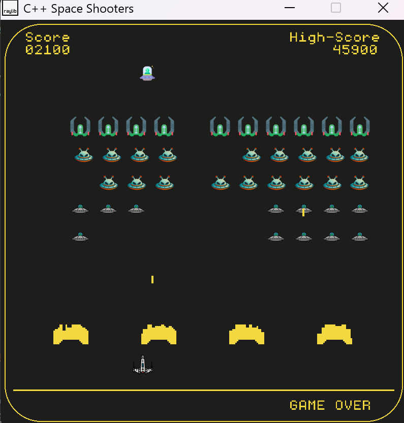

# C++ Space Invaders Game with raylib
This project is a classic arcade Space Shooters game, reminiscent of Space Invaders, built entirely in **C++ using the Raylib library**. Raylib serves as a simple and **easy-to-use** foundation for game development, handling everything from window management and drawing $2\text{D}$ textures to audio loading and playback. The game features a player-controlled spaceship firing lasers at various types of aliens organized in a descending formation, four destructible obstacles for defense, and a high-value mystery ship that occasionally crosses the screen. All core game logic, including alien movement patterns, collision detection, scoring, and high-score persistence via a text file, is implemented from scratch, demonstrating proficiency in **object-oriented programming (OOPs)** and game loop architecture.

**Gameplay Screenshot:**


* Open [Space-shooter](https://youtu.be/YGS7fWnQaO8) video to see the gameplay.
---
# Tech Stack:
 **The primary tech stack used for this game is:**

 **C++:** The core programming language for the entire project.
**Raylib:** The $2\text{D}$ game development library used for:
- Window and graphics management.Texture loading and drawing (DrawTextureV, LoadTexture).
- Input handling (IsKeyDown).
- Audio management (InitAudioDevice, LoadMusicStream, PlaySound).Collision detection (CheckCollisionRecs).
- Standard Library (STL): Used for managing dynamic collections of game objects.
---
# About:

**Features:**

1. Classic Arcade Gameplay:
-  Experience the familiar fixed-shooter action of defending against waves of descending aliens.
2. Multiple Alien Types: 
- Three distinct alien types, differentiated by their position in the formation and their scoring value (100, 200, and 300 points).
3. Destructible Shields (Obstacles): 
- Four defense barriers made up of individual blocks that can be destroyed by both player and alien fire.
4. Mystery Ship:
- A high-reward target (500 points) that randomly spawns and moves horizontally across the top of the screen.
5. High Score Persistence:
- Automatically tracks, saves, and loads the highest score achieved using file I/O (highscore.txt).
6. Raylib Integration: 
- Uses Raylib for fast $2\text{D}$ rendering, vector math, keyboard input, and audio streams (music and sound effects).


**Controls:**
A simple way of how to play the game:
```
- Move Left: LEFT ARROW key.

- Move Right: RIGHT ARROW key.

- Fire Laser: SPACE bar.

- Start/Restart Game: ENTER key (when "GAME OVER" is displayed).
```
# Game Flow Architecture:
```
                 ┌───────────────────────────┐
                 │         Game              │
                 │  (Central Controller)     │
                 └────────────┬──────────────┘
                              │
     ┌────────────────────────┼────────────────────────┐
     │                        │                        │
     ▼                        ▼                        ▼
┌─────────────┐         ┌─────────────┐          ┌─────────────┐
│  Spaceship  │         │   Alien     │          │  Obstacle   │
│ (Player)    │         │ (Enemy)     │          │ (Defense)   │
└────┬────────┘         └────┬────────┘          └────┬────────┘
     │                       │                        │
     │ Fires Lasers          │ Moves & Attacks        │ Formed by Blocks
     ▼                       ▼                        ▼
┌─────────────┐        ┌─────────────┐          ┌─────────────┐
│   Laser     │        │   Laser     │          │   Block     │
│ (Projectile)│        │ (Projectile)│          │ (Barrier)   │
└────┬────────┘        └────┬────────┘          └─────────────┘
     │                       │
     └────────────┬──────────┘
                  │
                  ▼
          ┌───────────────┐
          │ Collision &   │
          │ Scoring Logic │
          └───────────────┘
```
**Flow Summary:**
1. Game initializes all core entities (Spaceship, Alien, Obstacle) and manages:

- Updates per frame
- Collision checks
- Score updates
- Game-over conditions

2. Spaceship:

- Handles player input for movement.
- Fires Laser objects.

3. Alien:

- Moves in formation or pattern.
- Occasionally fires Laser toward the player.

4. Obstacle:

- Built from multiple Block units forming a defense barrier.

5. Laser / Block:

- The Laser interacts with all entities (Spaceship, Alien, Block).
- Collisions detected and handled by Game class.
---